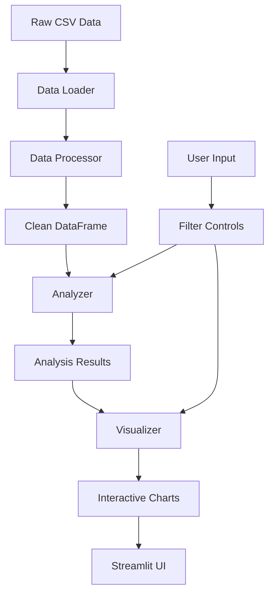

# Design Document

## Overview

The COVID-19 Research Analyzer is a Streamlit-based web application that processes and visualizes CORD-19 research metadata. The application follows a modular architecture with separate components for data loading, processing, analysis, and visualization. The design emphasizes user experience through interactive widgets and real-time updates while maintaining robust error handling and data validation.

## Architecture

The application uses a layered architecture pattern:

```
┌─────────────────────────────────────┐
│           Streamlit UI Layer        │
├─────────────────────────────────────┤
│        Visualization Layer          │
├─────────────────────────────────────┤
│         Analysis Layer              │
├─────────────────────────────────────┤
│       Data Processing Layer         │
├─────────────────────────────────────┤
│        Data Loading Layer           │
└─────────────────────────────────────┘
```

### Key Architectural Decisions

1. **Streamlit Framework**: Chosen for rapid development and built-in interactivity
2. **Pandas for Data Processing**: Leverages efficient data manipulation capabilities
3. **Modular Component Design**: Enables testing and maintainability
4. **Caching Strategy**: Uses Streamlit's caching to optimize performance
5. **Error Boundary Pattern**: Graceful degradation when components fail

## Components and Interfaces

### 1. Data Loading Component (`data_loader.py`)

**Purpose**: Handle CORD-19 metadata acquisition and initial loading

**Key Functions**:
- `load_metadata(file_path: str) -> pd.DataFrame`
- `validate_data_structure(df: pd.DataFrame) -> bool`
- `get_data_summary(df: pd.DataFrame) -> dict`

**Error Handling**: File not found, corrupted data, memory limitations

### 2. Data Processing Component (`data_processor.py`)

**Purpose**: Clean and prepare data for analysis

**Key Functions**:
- `clean_missing_values(df: pd.DataFrame, strategy: str) -> pd.DataFrame`
- `process_dates(df: pd.DataFrame) -> pd.DataFrame`
- `create_derived_columns(df: pd.DataFrame) -> pd.DataFrame`
- `extract_publication_year(df: pd.DataFrame) -> pd.DataFrame`

**Processing Pipeline**:
1. Missing value identification and handling
2. Date format standardization
3. Derived column creation (word counts, year extraction)
4. Data type optimization

### 3. Analysis Component (`analyzer.py`)

**Purpose**: Perform statistical analysis and generate insights

**Key Functions**:
- `analyze_temporal_trends(df: pd.DataFrame) -> dict`
- `get_top_journals(df: pd.DataFrame, n: int = 10) -> pd.Series`
- `extract_title_keywords(df: pd.DataFrame, n: int = 100) -> dict`
- `calculate_source_distribution(df: pd.DataFrame) -> pd.Series`

**Analysis Outputs**:
- Publication counts by year
- Journal rankings with paper counts
- Word frequency from titles
- Source distribution statistics

### 4. Visualization Component (`visualizer.py`)

**Purpose**: Create interactive charts and plots

**Key Functions**:
- `create_temporal_plot(data: dict) -> plotly.Figure`
- `create_journal_bar_chart(data: pd.Series) -> plotly.Figure`
- `generate_word_cloud(word_freq: dict) -> PIL.Image`
- `create_distribution_chart(data: pd.Series) -> plotly.Figure`

**Visualization Library Choices**:
- **Plotly**: Interactive charts with zoom, hover, and selection
- **WordCloud**: Text visualization for title analysis
- **Streamlit Native**: Simple charts for basic displays

### 5. Streamlit App Component (`app.py`)

**Purpose**: Main application interface and user interaction

**Key Features**:
- Sidebar controls for filtering and options
- Main content area with tabbed sections
- Real-time updates based on user input
- Progress indicators for long operations
- Error display and recovery options

## Data Models

### Core Data Structure

```python
@dataclass
class ResearchPaper:
    paper_id: str
    title: str
    authors: List[str]
    abstract: str
    publish_time: datetime
    journal: str
    source: str
    url: str
    
@dataclass
class AnalysisResults:
    temporal_trends: Dict[int, int]
    top_journals: pd.Series
    keyword_frequency: Dict[str, int]
    source_distribution: pd.Series
    total_papers: int
    date_range: Tuple[datetime, datetime]
```

### Data Flow



## Error Handling

### Error Categories and Strategies

1. **Data Loading Errors**
   - File not found: Display download instructions
   - Corrupted data: Show validation errors and suggest re-download
   - Memory errors: Implement chunked loading for large files

2. **Processing Errors**
   - Missing columns: Use default values or skip optional features
   - Date parsing failures: Log errors and use fallback formats
   - Type conversion errors: Maintain original data types where possible

3. **Analysis Errors**
   - Insufficient data: Display warnings and adjust analysis scope
   - Calculation failures: Use try-catch blocks with graceful degradation
   - Performance issues: Implement sampling for large datasets

4. **Visualization Errors**
   - Chart generation failures: Fall back to simple tables
   - Interactive widget errors: Disable problematic features
   - Display issues: Provide alternative text-based outputs

### Error Recovery Mechanisms

- **Graceful Degradation**: Continue with reduced functionality
- **User Feedback**: Clear error messages with suggested actions
- **Logging**: Detailed error logs for debugging
- **Fallback Options**: Alternative displays when primary methods fail

## Testing Strategy

### Unit Testing Approach

1. **Data Processing Tests**
   - Test missing value handling with various scenarios
   - Validate date parsing with different formats
   - Verify derived column calculations

2. **Analysis Function Tests**
   - Test trend analysis with sample datasets
   - Validate journal ranking algorithms
   - Check keyword extraction accuracy

3. **Visualization Tests**
   - Test chart generation with edge cases
   - Validate interactive widget behavior
   - Check responsive design elements

### Integration Testing

1. **End-to-End Workflows**
   - Complete data pipeline from load to display
   - User interaction scenarios
   - Error handling across components

2. **Performance Testing**
   - Large dataset handling
   - Memory usage optimization
   - Response time measurements

### User Acceptance Testing

1. **Usability Testing**
   - Interface navigation and clarity
   - Interactive element responsiveness
   - Error message comprehension

2. **Functionality Validation**
   - Analysis accuracy verification
   - Visualization correctness
   - Feature completeness assessment

## Performance Considerations

### Optimization Strategies

1. **Data Caching**: Use Streamlit's `@st.cache_data` for expensive operations
2. **Lazy Loading**: Load visualizations only when requested
3. **Sampling**: Use representative samples for large datasets
4. **Efficient Libraries**: Leverage optimized pandas operations

### Scalability Measures

1. **Memory Management**: Monitor and limit memory usage
2. **Processing Limits**: Set reasonable bounds on analysis scope
3. **User Experience**: Provide progress indicators for long operations
4. **Resource Monitoring**: Track application performance metrics